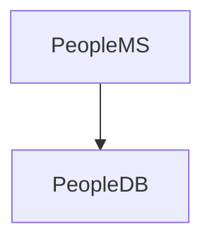
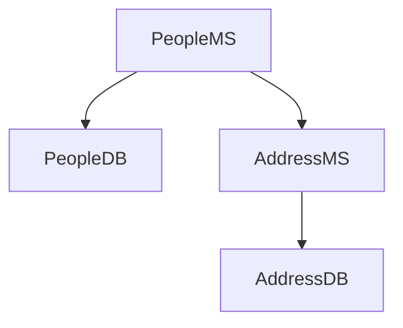

Um Simples crud com relacionamento utilizando o conceito de microserviços.


POST: /api/people
```
{
    "name": "Warley",
    "cpf": "036541657",
    "idade": 28
}
```


```mermaid
graph TD;
    PeopleMS-->PeopleDB;
```

GET: /api/people/1


```mermaid
graph TD;
    PeopleMS-->PeopleDB;
    PeopleMS-->AddressMS
    AddressMS-->AddressDB
```
